# Jarkom-Modul-4-IT32-2024
##### Praktikum Jaringan Komputer Modul 4 Tahun 2024

### Author
| Nama | NRP |
|---------|---------|
| Muhammad Kenas Galeno Putra | 5027231069   |
| Veri Rahman | 5027231088   |

# Laporan Resmi

# Daftar Isi
- [Topologi GNS](#topologi-gns)
- [Perhitungan CIDR](#perhitungan-cidr)
- [CIDR Tree](#cidr-tree)
- [Config dan Routing](#config-cidr)
- [Topologi CPT](#topologi-cpt)
- [Perhitungan VLSM](#perhitungan-vlsm)
- [VLSM Tree](#vlsm-tree)
- [Config dan Routing](#config-vlsm)

### Prefix IP
Kelompok kami memiliki prefix IP *10.79*

### Topologi GNS
<a name="topologi-gns"></a>
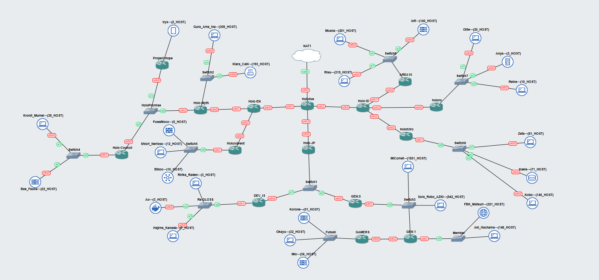

### Perhitungan CIDR
<a name="perhitungan-cidr"></a>
### Pengabungan
Cara :
1. Kelompokkan dari node terjauh dari awan. Hitung router terjauh
2. Gabungkan lagi dari yang sudah dikelompokkan sebelumnya

Pengabungan A
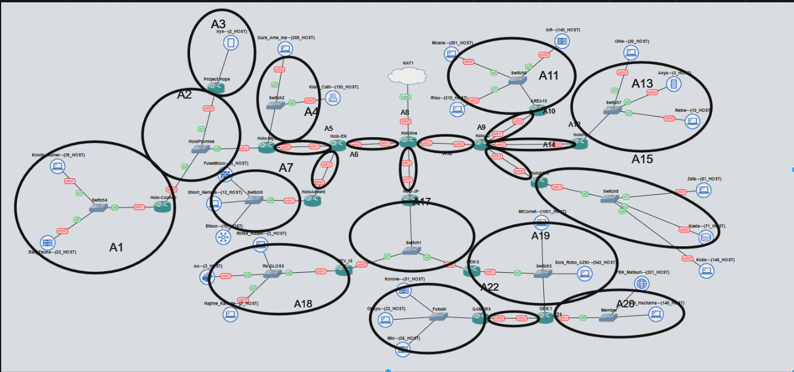
Pengabungan B
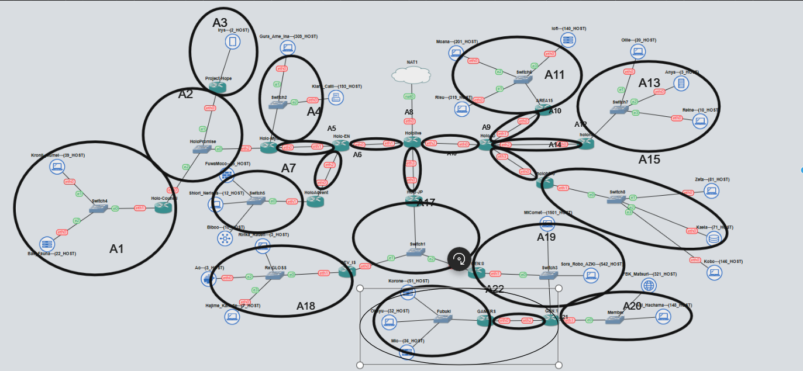
Pengabungan C
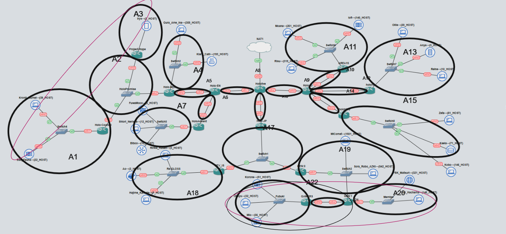
Pengabungan D
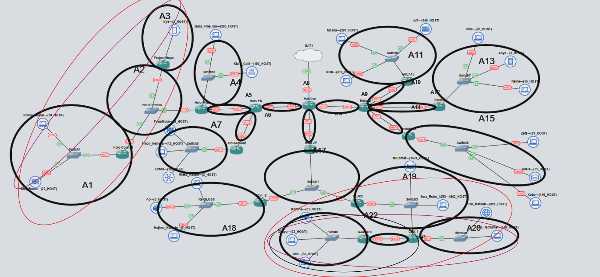
Pengabungan E
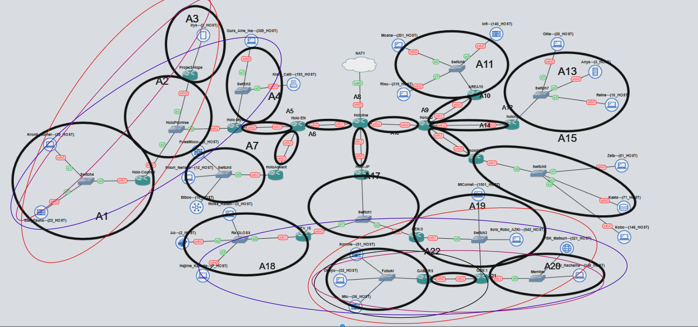
Pengabungan F
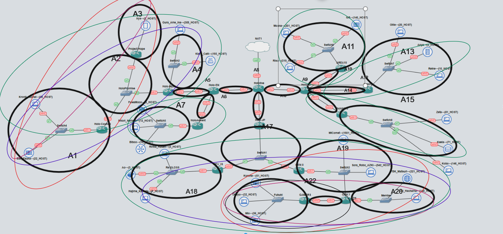
Pengabungan G
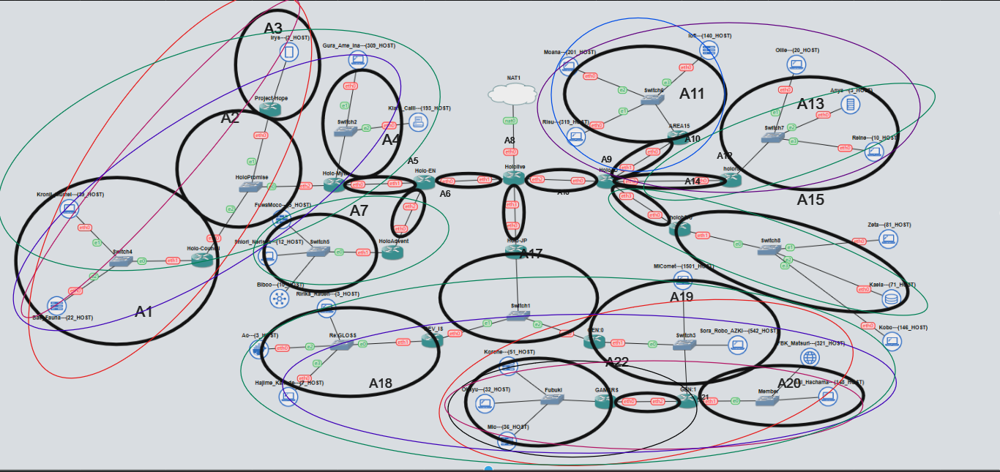
Pengabungan H
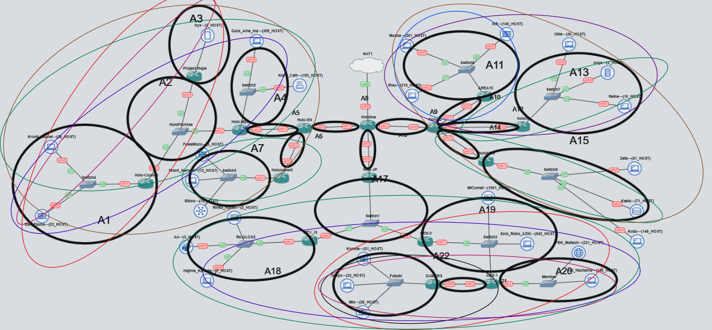
Pengabungan I
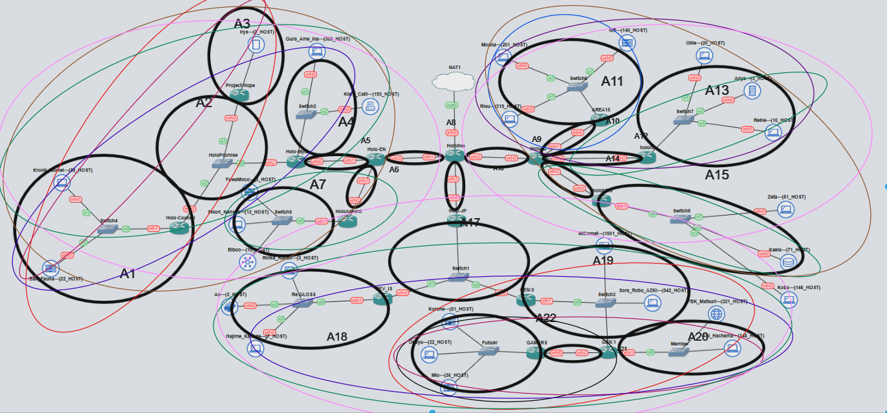
Pengabungan J
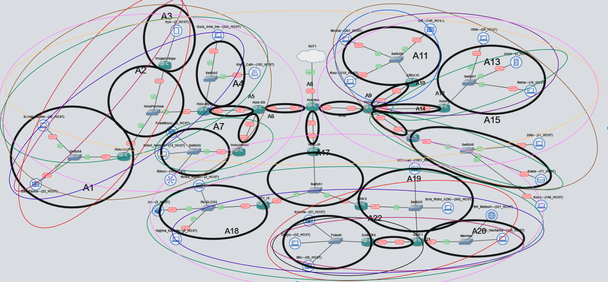
Pengabungan K
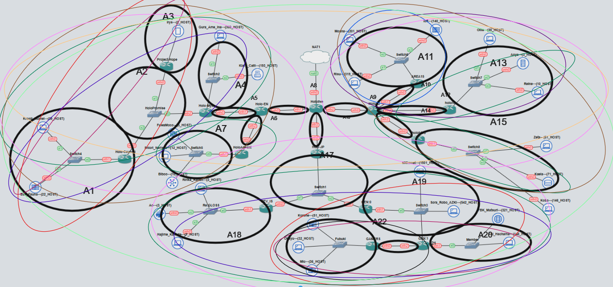

### CIDR Tree
<a name="cidr-tree"></a>


### Config dan Routing
<a name="config-cidr"></a>
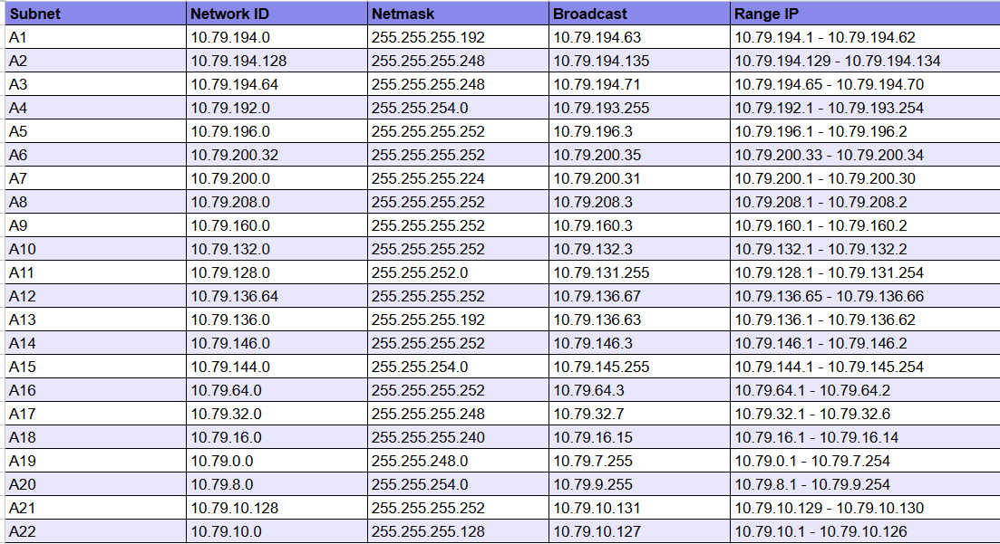

```bash
//Hololive(Gateaway)
#A8
auto lo
iface lo inet loopback

auto eth0
iface eth0 inet dhcp

auto eth1
iface eth1 inet static
    address 10.79.208.1
    netmask 255.255.255.252

#A9
auto eth2
iface eth2 inet static
    address 10.79.160.1
    netmask 255.255.255.252

#A16
auto eth3
iface eth3 inet static
    address 10.79.64.1
    netmask 255.255.255.252

//Holo-EN(Gateaway)
auto lo
iface lo inet loopback

auto eth0
iface eth0 inet dhcp

#A8
auto eth0
iface eth0 inet static
    address 10.79.208.2
    netmask 255.255.255.252
    gateway 10.79.208.1

#A5
auto eth1
iface eth1 inet static
    address 10.79.196.1
    netmask 255.255.255.252

#A6
auto eth2
iface eth2 inet static
    address 10.79.200.33
    netmask 255.255.255.252

//Holo-Myth(Gateaway)
auto lo
iface lo inet loopback

auto eth0
iface eth0 inet dhcp

#A5
auto eth0
iface eth0 inet static
    address 10.79.196.2
    netmask 255.255.255.252
    gateway 10.79.196.1

#A4
auto eth1
iface eth1 inet static
    address 10.79.192.1
    netmask 255.255.254.0

#A2
auto eth2
iface eth2 inet static
    address 10.79.194.129
    netmask 255.255.255.248

//Gura_Ame_Ina(Client)
#A4
auto eth0
iface eth0 inet static
    address 10.79.192.2
    netmask 255.255.254.0
    gateway 10.79.192.1

// Kiara_Calli(Client)
#A4
auto eth0
iface eth0 inet static
    address 10.79.192.3
    netmask 255.255.254.0
    gateway 10.79.192.1

//Holo Advent(Gateaway)
auto lo
iface lo inet loopback

auto eth0
iface eth0 inet dhcp

#A6
auto eth0
iface eth0 inet static
    address 10.79.200.34
    netmask 255.255.255.252
    gateway 10.79.200.33

#A7
auto eth1
iface eth1 inet static
    address 10.79.200.1
    netmask 255.255.255.224

//FuwaMoco(Client)
#A7
auto eth0
iface eth0 inet static
    address 10.79.200.2
    netmask 255.255.255.224
    gateway 10.79.200.1

//Shiori_Nerissa(Client)
#A7
auto eth0
iface eth0 inet static
    address 10.79.200.3
    netmask 255.255.255.224
    gateway 10.79.200.1

//Biboo(Client)
#A7
auto eth0
iface eth0 inet static
    address 10.79.200.4
    netmask 255.255.255.224
    gateway 10.79.200.1

//Project-Hope(Client)
auto lo
iface lo inet loopback

auto eth0
iface eth0 inet dhcp

#A2
auto eth0
iface eth0 inet static
    address 10.79.194.130
    netmask 255.255.255.248
    gateway 10.79.194.129

#A3
auto eth1
iface eth1 inet static
    address 10.79.194.65
    netmask 255.255.255.248

//Irys(Client)
#A3
auto eth0
iface eth0 inet static
    address 10.79.194.66
    netmask 255.255.255.248
    gateway 10.79.194.65

//Holo-Council(Gateaway)
auto lo
iface lo inet loopback

auto eth0
iface eth0 inet dhcp

#A2
auto eth0
iface eth0 inet static
    address 10.79.194.131
    netmask 255.255.255.248
    gateway 10.79.194.129

#A1
auto eth1
iface eth1 inet static
    address 10.79.194.1
    netmask 255.255.255.192

//Kronii-Mumei(Client)
#A1
auto eth0
iface eth0 inet static
    address 10.79.194.2
    netmask 255.255.255.192
    gateway 10.79.194.1

//Bae_Fauna(Client)
#A1
auto eth0
iface eth0 inet static
    address 10.79.194.3
    netmask 255.255.255.192
    gateway 10.79.194.1

//Holo-ID(Gateaway)
auto lo
iface lo inet loopback

auto eth0
iface eth0 inet dhcp

#A9
auto eth0
iface eth0 inet static
    address 10.79.160.2
    netmask 255.255.255.252
    gateaway 10.79.160.1

#A10
auto eth1
iface eth1 inet static
    address 10.79.132.1
    netmask 255.255.255.252

#A12
auto eth2
iface eth2 inet static
    address 10.79.136.65
    netmask 255.255.255.252

#A14
auto eth3
iface eth3 inet static
    address 10.79.146.1
    netmask 255.255.255.252

//AREA15(Gateaway)
auto lo
iface lo inet loopback

auto eth0
iface eth0 inet dhcp

#A10
auto eth0
iface eth0 inet static
    address 10.79.132.2
    netmask 255.255.255.252
    gateway 10.79.132.1

#A11
auto eth1
iface eth1 inet static
    address 10.79.128.1
    netmask 255.255.252.0

//Iofi(Client)
#A11
auto eth0
iface eth0 inet static
    address 10.79.128.2
    netmask 255.255.252.0
    gateway 10.79.128.1

//Moona(Client)
#A11
auto eth0
iface eth0 inet static
    address 10.79.128.3
    netmask 255.255.252.0
    gateway 10.79.128.1

//Risu(Client)
#A11
auto eth0
iface eth0 inet static
    address 10.79.128.4
    netmask 255.255.252.0
    gateway 10.79.128.1

//holoro(Gateaway)
auto lo
iface lo inet loopback

auto eth0
iface eth0 inet dhcp

#A12
auto eth0
iface eth0 inet static
    address 10.79.136.66
    netmask 255.255.255.252
    gateway 10.79.136.65

#A13
auto eth1
iface eth1 inet static
    address 10.79.136.1
    netmask 255.255.252.192

//Ollie(Client)
#A13
auto eth0
iface eth0 inet static
    address 10.79.136.2
    netmask 255.255.252.192
    gateway 10.79.136.1

//Anya(Client)
#A13
auto eth0
iface eth0 inet static
    address 10.79.136.3
    netmask 255.255.252.192
    gateway 10.79.136.1

//Reine(Client)
#A13
auto eth0
iface eth0 inet static
    address 10.79.126.4
    netmask 255.255.252.192
    gateway 10.79.126.1

//holoh3ro(Gateaway)
auto lo
iface lo inet loopback

auto eth0
iface eth0 inet dhcp

#A14
auto eth0
iface eth0 inet static
    address 10.79.146.2
    netmask 255.255.255.252
    gateway 10.79.146.1

#A15
auto eth1
iface eth1 inet static
    address 10.79.144.1
    netmask 255.255.254.0

//Zeta(Client)
#A15
auto eth0
iface eth0 inet static
    address 10.79.144.2
    netmask 255.255.254.0
    gateway 10.79.144.1

//Kaela(Client)
#A15
auto eth0
iface eth0 inet static
    address 10.79.144.3
    netmask 255.255.254.0
    gateway 10.79.144.1

//Kobo(Client)
#A15
auto eth0
iface eth0 inet static
    address 10.79.144.4
    netmask 255.255.254.0
    gateway 10.79.144.1

//Holo-JP(Gateaway)
auto lo
iface lo inet loopback

auto eth0
iface eth0 inet dhcp

#A16
auto eth0
iface eth0 inet static
    address 10.79.64.2
    netmask 255.255.255.252
    gateaway 10.79.64.1

#A17
auto eth1
iface eth1 inet static
    address 10.79.32.1
    netmask 255.255.255.252

//DEV_IS(Gateaway)
auto lo
iface lo inet loopback

auto eth0
iface eth0 inet dhcp

#A17
auto eth0
iface eth0 inet static
    address 10.79.32.2
    netmask 255.255.255.252
    gateway 10.79.32.1

#A18
auto eth1
iface eth1 inet static
    address 10.79.16.1
    netmask 255.255.255.240

//Ririka_Raden(Client)
#A18
auto eth0
iface eth0 inet static
    address 10.79.16.2
    netmask 255.255.255.240
    gateway 10.79.16.1

//Ao(Client)
#A18
auto eth0
iface eth0 inet static
    address 10.79.16.3
    netmask 255.255.255.240
    gateway 10.79.16.1

//Hajime_Kanade(Client)
#A18
auto eth0
iface eth0 inet static
    address 10.79.16.4
    netmask 255.255.255.240
    gateway 10.79.16.1

//GEN:0(Gateaway)
auto lo
iface lo inet loopback

auto eth0
iface eth0 inet dhcp

#A17
auto eth0
iface eth0 inet static
    address 10.79.32.3
    netmask 255.255.255.252
    gateway 10.79.32.1

#A19
auto eth1
iface eth1 inet static
    address 10.79.0.1
    netmask 255.255.248.0

//MiComet(Client)
#A19
auto eth0
iface eth0 inet static
    address 10.79.0.2
    netmask 255.255.248.0
    gateway 10.79.0.1

//Sora_Robo_Zaki(Client)
#A19
auto eth0
iface eth0 inet static
    address 10.79.0.3
    netmask 255.255.248.0
    gateway 10.79.0.1

//GEN:1(Gateaway)
auto lo
iface lo inet loopback

auto eth0
iface eth0 inet dhcp

#A19
auto eth0
iface eth0 inet static
    address 10.79.0.4
    netmask 255.255.248.0
    gateway 10.79.0.1

#A20
auto eth1
iface eth1 inet static
    address 10.79.8.1
    netmask 255.255.254.0

#A21
auto eth2
iface eth2 inet static
    address 10.79.10.129
    netmask 255.255.255.252

//FBK_Matsuri(Client)
#A20
auto eth0
iface eth0 inet static
    address 10.79.8.2
    netmask 255.255.248.0
    gateway 10.79.8.1

//Aki_Hachama(Client)
#A20
auto eth0
iface eth0 inet static
    address 10.79.8.3
    netmask 255.255.248.0
    gateway 10.79.8.1

//Gamers(Gateaway)
auto lo
iface lo inet loopback

auto eth0
iface eth0 inet dhcp

#A21
auto eth0
iface eth0 inet static
    address 10.79.10.130
    netmask 255.255.255.252
    gateway 10.79.10.129

#A22
auto eth1
iface eth1 inet static
    address 10.79.10.1
    netmask 255.255.255.128

//Korone(Client)
#A22
auto eth0
iface eth0 inet static
    address 10.79.10.2
    netmask 255.255.255.128
    gateway 10.79.10.1

//Okayu(Client)
#A22
auto eth0
iface eth0 inet static
    address 10.79.10.3
    netmask 255.255.255.128
    gateway 10.79.10.1

//Mio(Client)
#A22
auto eth0
iface eth0 inet static
    address 10.79.10.4
    netmask 255.255.255.128
    gateway 10.79.10.1
```

### Topologi CPT
<a name="topologi-cpt"></a>


### Perhitungan VLSM
<a name="perhitungan-vlsm"></a>


### VLSM Tree
<a name="vlsm-tree"></a>


### Config dan Routing
<a name="config-vlsm"></a>


